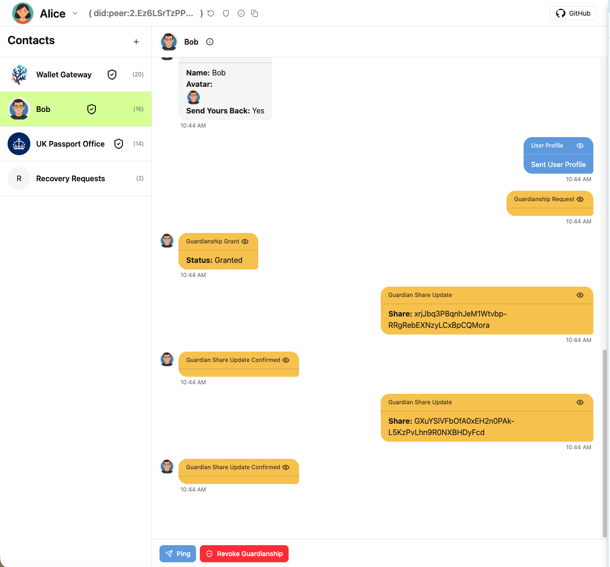

# CoralKM: Decentralized Key Management Protocol Demo

CoralKM is a proposed [DIDComm](https://didcomm.org/) Protocol standard for providing easy self-custody of encryption keys/wallets using Guardian's and social recovery. It is designed to be use friendly to maximise adoption, and work for the lifetime of the User from cradle to grave, without the need to remember passwords, or store seed phrases, both of which can be compromised or forgotten/lost.

Guardians can be friends and family, but also trusted institutions like Government Agencies, Banks, Cloud Providers, Law Firms etc. Each Guardian can use the protocol to send Identity Verfication Challenges during Recovery, and the User has complete control to select who they want their Guardian's to be, and manage them over time. Some Guardians like your friend and family could be as simple as meeting them in person to scan a QR code, Banks and other highly secure institutions may require a more complex in-person verification. User's can select Guardian's based on their level of trust and the Guardian's capabilities and security. The protocol will not reveal to anyone who the Guardian's are, and is designed to be privacy preserving to reduce the chance of collusion between Guardians.

This is an early demo of the protocol, a lot of details still need fleshing out, but the core idea is to show how Wallets can add/remove Guardians, automatically have the Wallet update shares over time as the user rotates keys or changes Guardians, and show a worse-case scenario Recovery Process that doesn't rely on the user having to trust themselves to secure, store and remember seed phrases or other technical details, to work.

The demo builds on the [Veramo Agent Framework](https://veramo.io/) from the Identity Foundation to provide the core DID/Key/DIDComm protocol support.

- **Protocol Specification (Draft)**: [./docs/protocol-overview.md](./docs/coralkm.md)
- **Demo Instructions**: [./docs/demo-instructions.md](./docs/demo.md)



## Repository layout

Top-level packages (under `./packages`):

- `@coralstack/core` — shared core library, Veramo plugins, DID utilities and protocol handlers
- `@coralstack/gateway` — Cloudflare Worker gateway, DidComm mediator, and message router
- `@coralstack/wallet` — React wallet SPA used to demo and interact with the protocol
- `@coralstack/guardian` — security/validation helpers and monitoring (optional)

There are also tooling and config files at the repository root (TypeScript base config, Yarn/corepack, CI, etc.). See `.github/copilot-instructions.md` for development conventions used in this repo.

## Quickstart — local development

Prerequisites

- Node.js 22.x (use the repo `.nvmrc`):

```bash
nvm use
```

- Yarn (Corepack is supported; `yarn` is used to manage workspaces)

Install dependencies

```bash
yarn install
```

Build the core library first:

```bash
yarn workspace @coralkm/core build
```

Setup the Cloudflare Worker D1 database schema migrations for the wallet gateway:

```bash
yarn workspace @coralkm/gateway apply-migrations
```

Run a single package in dev (examples)

```bash
# Start the wallet gateway worker first
yarn workspace @coralkm/gateway dev

# Start the wallet dev server (Vite)
yarn workspace @coralkm/wallet dev --force
```

Workspace helpers

Use `yarn workspace <pkg>` for package-scoped tasks. Examples:

```bash
yarn workspace @coralkm/core build
yarn workspace @coralkm/gateway test
yarn workspace @coralkm/wallet build
```

## Testing

Top-level test commands (when available in packages):

```bash
yarn test        # Run workspace test scripts in watch mode where defined
yarn test:run    # Run tests once (package-specific scripts may vary)
```

Package test examples:

```bash
yarn workspace @coralkm/core test
yarn workspace @coralkm/gateway test
```

## Development notes & conventions

- Use `nvm` to match the Node version in `.nvmrc`.
- Build outputs for TypeScript packages are emitted under each package `dist/` directory.
- The `@coralkm/core` package is a central shared dependency — package consumers should prefer the ESM source when running in browser environments (Vite) to avoid CJS/ESM interop pitfalls.
- For Cloudflare Worker tests, the repository uses `@cloudflare/vitest-pool-workers` in the `gateway` package.

## Security

- Never log or commit private keys, mnemonic phrases, or any sensitive material.
- Follow the principle of least privilege and use secure cryptography primitives (Veramo, KMSs) when implementing key operations.

## Contributing

See `.github/copilot-instructions.md` for contribution guidelines, workspace development patterns, and test conventions.

## License

Licensed under the MIT License. See the `LICENSE` file in the repository root for details.
